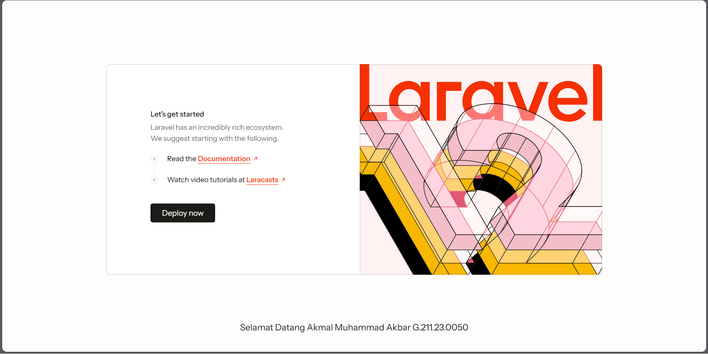

# Laravel Google OAuth Authentication



## 📋 Tentang Project
Project ini adalah implementasi sistem autentikasi pengguna berbasis **Identity as a Service (IDaaS)** menggunakan **Laravel**. Fokus utama dari aplikasi ini adalah fitur login yang aman dan mudah menggunakan **Google OAuth**.

Aplikasi ini dibuat sebagai bagian dari tugas/project kuliah untuk mendemonstrasikan integrasi API Google Cloud Platform dengan framework Laravel.

**Dibuat oleh:**
* **Nama:** Akmal Muhammad Akbar
* **NIM:** G.211.23.0050

---

## 🚀 Fitur Utama
* **User Login System:** Sistem login pengguna standar.
* **Google OAuth Integration:** Login instan menggunakan akun Google (Gmail).
* **Identity Management:** Pengelolaan sesi dan identitas pengguna yang aman.
* **Landing Page:** Halaman muka default Laravel yang telah disesuaikan.

## 🛠️ Teknologi yang Digunakan
* [Laravel](https://laravel.com/) - Web Framework
* [Google Cloud Platform](https://console.cloud.google.com/) - Untuk kredensial OAuth 2.0
* PHP
* Composer

## 💻 Cara Instalasi (Localhost)

Ikuti langkah ini untuk menjalankan project di komputer lokal:

1.  **Clone Repository**
    ```bash
    git clone [https://github.com/username-kamu/nama-repo.git](https://github.com/username-kamu/nama-repo.git)
    cd nama-repo
    ```

2.  **Install Dependencies**
    ```bash
    composer install
    npm install
    ```

3.  **Setup Environment**
    Duplikat file `.env.example` menjadi `.env`:
    ```bash
    cp .env.example .env
    ```

4.  **Konfigurasi Database & Google OAuth**
    Buka file `.env` dan atur database serta kredensial Google:
    ```env
    DB_DATABASE=nama_database_kamu

    # Tambahkan kredensial dari Google Console
    GOOGLE_CLIENT_ID=your-google-client-id
    GOOGLE_CLIENT_SECRET=your-google-client-secret
    GOOGLE_REDIRECT_URI=[http://127.0.0.1:8000/auth/google/callback](http://127.0.0.1:8000/auth/google/callback)
    ```

5.  **Generate Key & Migrate**
    ```bash
    php artisan key:generate
    php artisan migrate
    ```

6.  **Jalankan Aplikasi**
    ```bash
    php artisan serve
    ```
    Buka browser dan akses: `http://127.0.0.1:8000`

---

## 📷 Preview
Seperti yang terlihat pada screenshot di atas, halaman utama menampilkan landing page Laravel dengan footer identitas mahasiswa pengembang.

---
